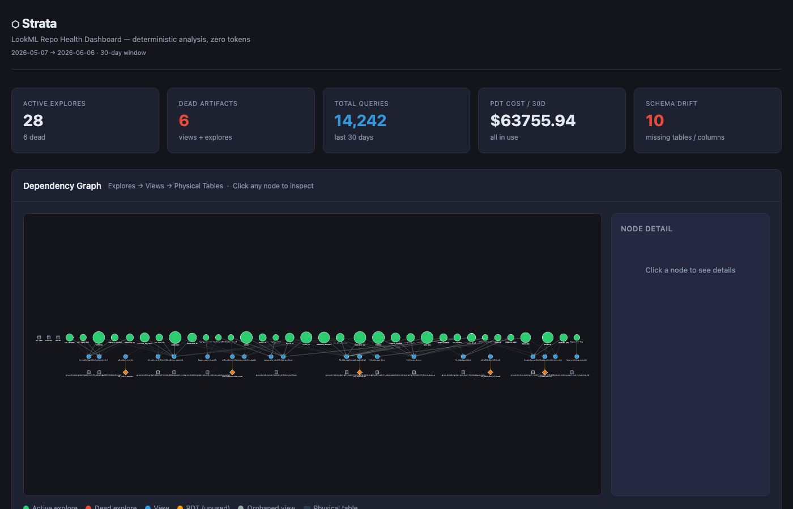
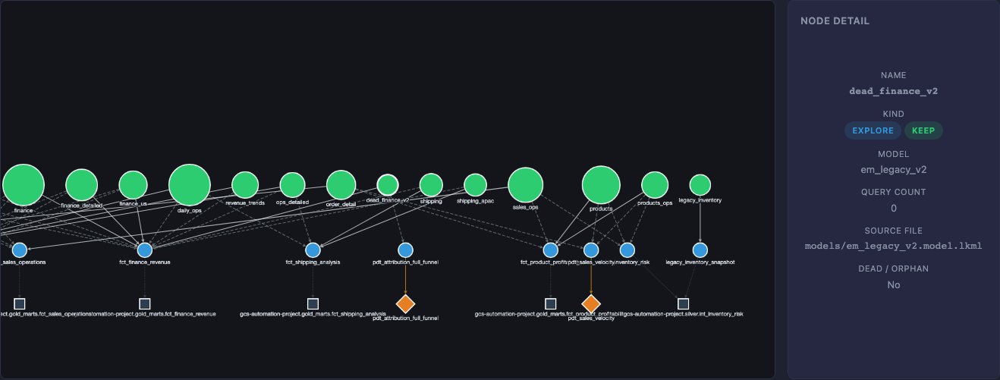
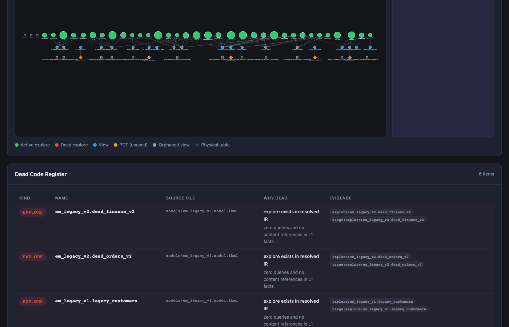

# Strata

LookML repos accumulate debt silently. Explores stop getting queried. PDTs keep rebuilding.
Fields reference columns that got dropped in the last migration. Nobody's dashboards break —
yet — but the cost is real and the risk is compounding.

The tools that exist today help you write LookML correctly. Strata helps you understand what
your LookML is actually doing, what it costs, and what it's safe to change.

---

## The Gap

| Tool | What it does | Where it stops |
|---|---|---|
| **LookML IDE / Extension** | Syntax validation, autocomplete, inline errors | Doesn't know query history, cost, or which explores are actually used |
| **Looker MCP Server** | Gives Claude live API access to Looker objects and system activity | A bridge for agents — surfaces data, doesn't analyze it |
| **Spectacles / content validation** | Runs explores in Looker to catch SQL compile errors | Reactive — tests what exists, doesn't surface what should be removed |
| **Looker native alerting** | Flags broken dashboards and scheduled query failures | Catches failures after they happen, not structural risk before it does |

None of these answer:

- Which of my 80 explores has zero queries in the last 30 days?
- Which PDTs are rebuilding on a schedule but serving nobody?
- If I drop this BQ column, what breaks — and how bad?
- Can I remove this view without touching a dashboard anywhere?
- What's the minimum set of explores I need to revalidate before merging this PR?

Strata is the analysis layer between your static LookML files and your living Looker instance.
It builds a complete dependency graph offline, enriches it with usage and cost data, and gives
you deterministic answers — in CI, in your IDE, or in a Claude session.

---

## Philosophy

> Do the heavy lifting deterministically. Use AI as a thin synthesis layer over pre-digested structure.

Parsing LookML, resolving extends chains, detecting dead code, computing PDT cost — these
are deterministic problems. They cost zero tokens. The structure doesn't need an LLM to
understand it; it needs to be mapped.

Strata maps it first. Then a cheap model reasons over a clean, structured context. This gets
more capable as models improve, and cheaper over time. The deterministic layer never changes.

**L0 and L1 never call any LLM or external API.** The MCP server is stdio-only. All
analysis runs locally on a read-only clone. Nothing is sent anywhere.

---

## What It Enables

**Dead code campaigns.** Know exactly which explores haven't been queried, for how long,
and whether any dashboard content still references them. Dual evidence — structural orphan
status *and* zero usage — prevents false positives before you deprecate anything.

**PDT cost visibility.** Surface which PDTs are building on schedule but serving dead
explores. Cross-reference build cost with query volume to identify zombie compute. Get the
annualized number before you walk into the conversation with the team.

**Safe migrations.** Before dropping a BQ column or renaming a table, run impact analysis
across the full LookML graph. See every view, explore, and field that depends on it. Know
the blast radius before the first PR is opened.

**Schema drift detection.** LookML that references a column the warehouse dropped compiles
fine in Looker — it just fails silently at query time. Strata catches these before your users do.

**CI governance.** `make ci` runs the full analysis suite offline — no Looker instance, no
credentials, no flaky API calls. Every PR gets deterministic gate coverage: extends chains
resolved, dead code counted, drift checked, validation scope computed.

**IDE-native investigation.** Load Strata as an MCP server in Claude Code. Ask it which
explores break if you change a view. Ask it to audit your PDT costs. Ask it what needs
revalidation before a merge. It answers from a pre-built IR — fast, read-only, local.

---

## How It Works

```
LookML repo (read-only clone)
        │
        ▼
   L0 — IR Builder
        Parse all .lkml files → canonical node/edge graph
        Resolve extends chains, refinements, cross-model dependencies
        No LLM. No network. Pure deterministic Python.
        │
        ▼
   L1 — Enrichment
        Join IR against usage facts (explore queries, PDT builds)
        Join IR against schema facts (warehouse column inventory)
        Produces: dead code evidence, PDT cost ledger, schema drift records
        │
        ▼
   L2 — Synthesis
        One explore = one verdict with evidence
        Cheap model, clean structured context
        Outputs: cleanup roadmap, migration impact, validation scope
        │
        ├── JSON artifacts   catalog / dead code / PDT ledger / drift / impact / ...
        ├── HTML dashboard   make dashboard
        └── MCP tools        10 read-only tools, stdio, IDE-native
```

Usage and schema facts come from fixture files (offline CI) or live Looker System Activity
(opt-in). The pipeline is identical either way — the seam is at L1.

---

## Dashboard



*enterprise_mono playground — 34 explores, 19 models, 30-day window. Color legend: green = active explore, red = dead explore, blue = view, orange = unused PDT, gray = physical table.*



*Dependency graph — `dead_finance_v2` selected. Node detail shows KIND: EXPLORE, QUERY COUNT: 0, MODEL: em_legacy_v2. The orange diamond is `pdt_attribution_full_funnel` — a zombie PDT rebuilding at $45,000/month to serve this explore. Both are flagged for removal.*



*Dead Code Register — each item carries two evidence tags: structural (exists in resolved IR) and usage (zero queries in L1 facts). Both must be present before anything is flagged.*

---

## Evidence

These findings come from the three reference playgrounds included in the repo. Full numbers
and methodology in [`docs/testing-findings.md`](docs/testing-findings.md).

**enterprise_mono** — 19 models, 34 explores, cross-model extends, 3 legacy connection clusters:

- 6 dead explores (0 queries over 30 days) — all flagged with dual evidence
- 2 zombie PDTs rebuilding at $63,750/month — backed exclusively by dead explores
- Annualized exposure: **~$765,000/year** in compute serving no users
- 7 real schema drift hits across 3 legacy view files — silent failures waiting to happen

**gcs_analytics** — gold/silver BQ layer, mixed active and legacy:

- 4 dead items (2 orphan views, 2 dead explores)
- 1 unused PDT ($156/month) — defined but no explore references it
- 1 schema drift hit

**thelook** — structural baseline, pure L0:

- 5 dead items (1 orphan view, 4 dead explores)
- 1 zombie PDT ($432/month)

These are test repos with deliberately injected signals. Against a real production LookML
monorepo, the numbers scale.

---

## Ecosystem Fit

| | Looker MCP Server | Looker Extension | Strata |
|---|---|---|---|
| **What it is** | Claude ↔ Looker API bridge | React app embedded in Looker UI | LookML static analysis engine |
| **What it does** | Live explore queries, system activity, content management via agent | In-UI tooling: custom actions, AI panels, embedded views | IR graph, dead code, PDT cost, drift, blast radius — offline |
| **Data access** | Live Looker API | Live Looker embed | Read-only LookML clone + usage/schema facts |
| **Where it runs** | Local MCP server (stdio) | Inside Looker UI | Local CLI, CI, or IDE MCP server |
| **Analysis** | Surfaces data — agent reasons over it | In-product actions and display | Deterministic analysis — agent reasons over structured IR |

Strata consumes what the Looker MCP Server surfaces (usage facts, system activity) and
produces what a Looker Extension could display (cost ledger, cleanup roadmap, drift report).
The three tools are complementary layers, not competitors.

---

## Quickstart

```bash
git clone https://github.com/G-Schumacher44/strata-oss.git
cd strata-oss
python3 -m venv .venv && source .venv/bin/activate
pip install -e ".[dev]"
make ci           # runs against the included gcs_analytics playground
make dashboard    # opens the HTML dashboard at localhost:8765
```

Point at your own repo:

```makefile
# .strata  (copy from .strata.example, gitignored)
REPO   = /path/to/your/lookml
USAGE  = /path/to/usage_facts.json
SCHEMA = /path/to/schema_facts.json
```

Then `make ci`, `make outputs`, `make dashboard` all use your repo.

---

## MCP (Claude Code / IDE)

`.mcp.json` is included — Claude Code loads Strata automatically as an MCP server.

```bash
# Point at any playground or your own repo
STRATA_REPO_PATH=tests/lookml/enterprise_mono \
STRATA_USAGE_FIXTURE=tests/fixtures/enterprise_usage_facts.json \
bash scripts/mcp_server.sh
```

10 read-only tools: `strata_ir_status`, `strata_usage_summary`, `strata_dead_code_register`,
`strata_pdt_costs`, `strata_schema_drift`, `strata_explore_deps`, `strata_query_field`,
`strata_list_orphans`, `strata_validation_scope`, `strata_impact`.

Investigation workflows in [`skills/strata_workflow.md`](skills/strata_workflow.md).

---

## Docs

| | |
|---|---|
| [`docs/testing-findings.md`](docs/testing-findings.md) | Full findings from all three playgrounds — real numbers, methodology, known gaps |
| [`docs/testing-scenarios.md`](docs/testing-scenarios.md) | Three verification scenarios: structural, enrichment, enterprise G4 |
| [`docs/playground-guide.md`](docs/playground-guide.md) | Tour of each playground and what signals to look for |
| [`docs/offline-first-walkthrough.md`](docs/offline-first-walkthrough.md) | Full analysis without any external dependencies |
| [`docs/security-hardening.md`](docs/security-hardening.md) | Read-only enforcement, credential handling, MCP security model |
| [`docs/enterprise-deployment.md`](docs/enterprise-deployment.md) | IAM, ADC, OIDC for GH Actions, Google Workspace path |
| [`docs/looker-ecosystem.md`](docs/looker-ecosystem.md) | Full ecosystem breakdown: Looker MCP, Extension, and Strata |
| [`skills/strata_workflow.md`](skills/strata_workflow.md) | Step-by-step workflow for humans and agents |
| [`skills/strata_agentic_runbook.md`](skills/strata_agentic_runbook.md) | Autonomous governance investigation playbook |
| [`docs/CONTRIBUTING.md`](docs/CONTRIBUTING.md) | Contribution guide |

---

## License

Apache 2.0. See [`docs/CONTRIBUTING.md`](docs/CONTRIBUTING.md).
