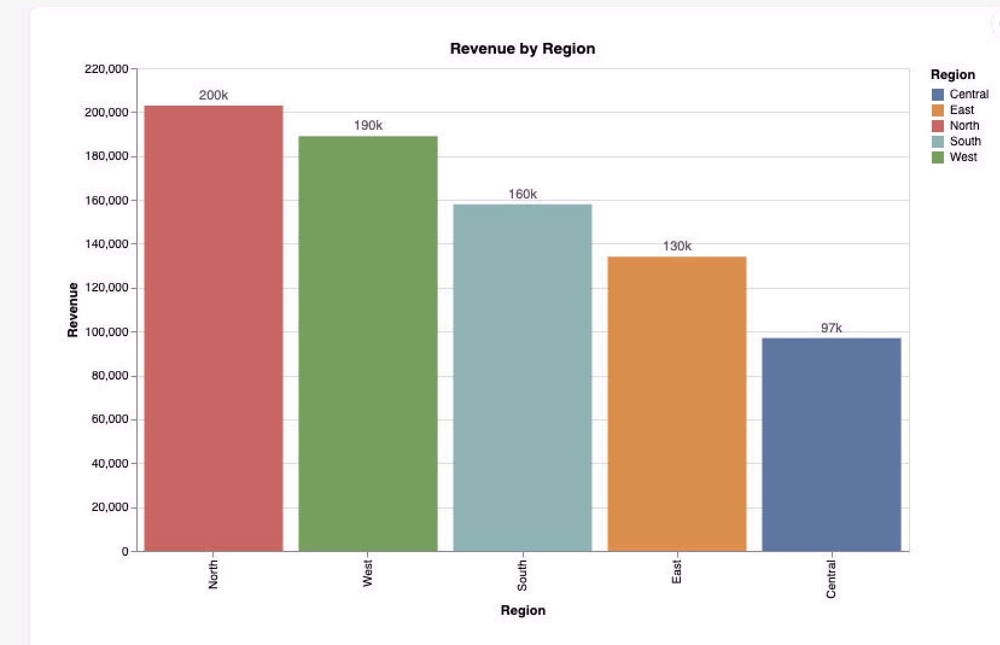
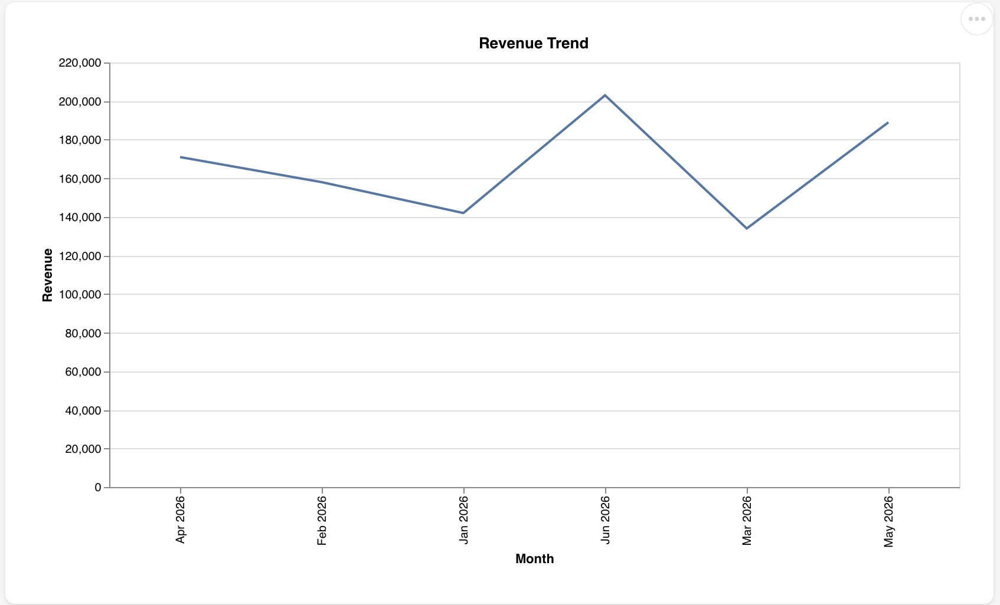
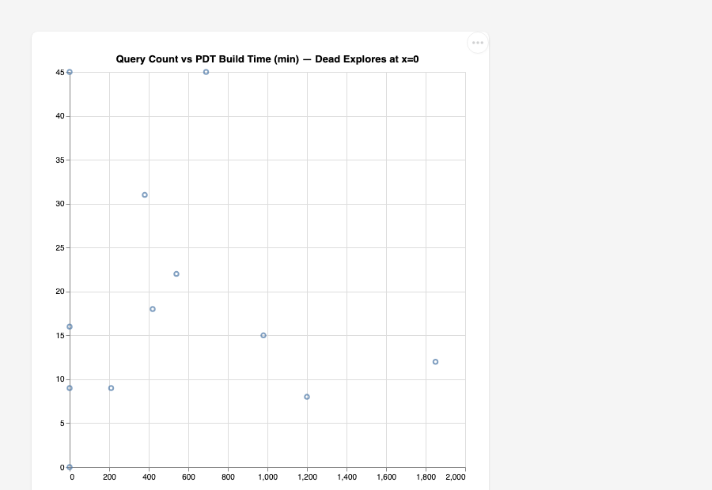
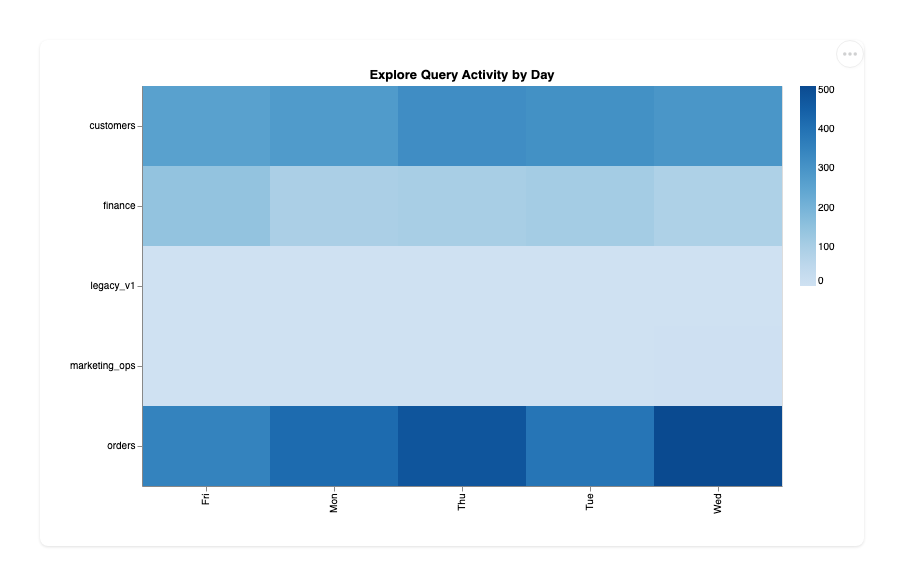

# Strata — Agentic BI Toolkit for Looker and BigQuery

<div align="center">
  
</div>

<div align="center">

[](https://github.com/G-Schumacher44/strata/actions/workflows/strata-ci.yml)
[](LICENSE)
[](https://www.python.org/)
[](https://modelcontextprotocol.io)
[](#quick-start)

</div>

If you're a BI engineer or analyst running Looker on BigQuery, your existing tools validate syntax
and catch broken SQL. They usually do not answer the governance questions that decide whether a
semantic-layer change is safe:

- Which explores had zero queries in the last 30 days?
- Which PDTs are rebuilding nightly at ~$45,000/month in estimated BQ compute to serve nobody?
- Which BigQuery column drops will silently break LookML before users find out at query time?

## What Strata Is

Strata is a local **MCP** server and **CLI** toolkit. Point it at your **LookML** repo. Your AI client
gets **18 read-only analysis tools**, and **15 domain skills** with structured investigation procedures,
and a pre-built graph of your resolved LookML dependency structure — enriched with BigQuery usage
and schema facts. Offline-first: connecting to your Looker instance is preferred but optional; no credentials are required to start.

---

## Quick Start

```bash
# Install
pip install -e ".[dev]"

# Bootstrap your repo — creates conductor/, .mcp.json, and config
strata bootstrap --repo /path/to/your/lookml

# Wire your AI client (Claude Code, Cursor, Gemini)
# .mcp.json is written by bootstrap, or add manually:
```

```json
{
  "mcpServers": {
    "strata": {
      "command": "strata-mcp",
      "env": { "STRATA_REPO_PATH": "/path/to/your/lookml" }
    }
  }
}
```

Verify everything is wired before opening your AI client:

```bash
STRATA_REPO_PATH=/path/to/your/lookml strata mcp validate
```

Live Looker enrichment is opt-in — start with offline fixtures, add `strata auth login` when ready.
See [Looker OAuth and Token Management](#looker-oauth-and-token-management).

<details>
<summary>Try it now with bundled playgrounds</summary>

Three LookML repos and matching fixture JSON ship in the repo. Run the full
analysis stack offline in under a minute:

```bash
git clone https://github.com/G-Schumacher44/strata.git
cd strata
pip install -e ".[dev]"
```

```bash
export STRATA_REPO_PATH=tests/lookml/enterprise_mono
export STRATA_USAGE_FIXTURE=tests/fixtures/enterprise_usage_facts.json
export STRATA_SCHEMA_FIXTURE=tests/fixtures/enterprise_schema_facts.json
```

```bash
$ strata check
Strata scenario gates passed.

$ strata query status
{
  "node_counts": {"explore": 34, "view": 20, "field": 196, "pdt": 5},
  "edge_count": 378
}

$ strata outputs --out /tmp/strata-demo
{
  "catalog": "/tmp/strata-demo/catalog.json",
  "dead_code_register": "/tmp/strata-demo/dead_code_register.json",
  "pdt_ledger": "/tmp/strata-demo/pdt_ledger.json",
  "schema_drift": "/tmp/strata-demo/schema_drift.json",
  "usage_summary": "/tmp/strata-demo/usage_summary.json",
  "cleanup_roadmap": "/tmp/strata-demo/cleanup_roadmap.json",
  "migration_impact": "/tmp/strata-demo/migration_impact.json",
  "validation_scope": "/tmp/strata-demo/validation_scope.json"
}

$ strata mcp validate
  repo:       .../tests/lookml/enterprise_mono  (from STRATA_REPO_PATH env)
  ✓ repo path exists
  ✓ IR cache found (age: 2235s)
  ✓ skills: 15 found
  ✓ chart templates: 4 found
  ~ BQ project: not set (gcloud default will be used; set bq_project in ~/.strata/config.json for 2-part table names)
  ✗ Looker token missing — run `strata auth login`

  MCP server is ready.
```

All three included playgrounds (`enterprise_mono`, `gcs_analytics`, `thelook`) have matching
usage and schema fixture JSON in `tests/fixtures/` — swap `--repo` and `--*-fixture` to run
against any of them.

</details>

<details>
<summary>Developer workflow</summary>

Strata utilizes **Ruff** for linting/formatting and **Mypy** for type checking.

**Linting and type checking:**

```bash
# Run both ruff and mypy
strata lint

# Fix safe violations automatically
strata lint --fix --format
```

Install pre-commit hooks to run checks automatically on every commit:

```bash
pre-commit install
```

Every PR is gated by:
- `ruff check src/ tests/`
- `ruff format --check src/ tests/`
- `mypy src/strata --ignore-missing-imports`
- `python -m pytest`

See [`.github/workflows/strata-ci.yml`](.github/workflows/strata-ci.yml) for details.

</details>

---

## LookML Governance

The flagship analysis. Runs fully offline from your LookML files and fixture JSON —
no Looker instance, no BQ credentials, no flaky API calls.

### Dead Code Campaigns

Strata builds a resolved dependency graph covering explores, views, joins, extends chains,
fields, PDTs, and physical tables. Cross-reference against 30 days of Looker System Activity
and content usage data, and you get exact dead code with dual evidence: the explore exists in
the resolved IR *and* has zero queries with no dashboard references. No false positives before
you deprecate.

From the `enterprise_mono` playground:
- **6 dead explores** across 3 legacy connection clusters
- **5 zombie views** — referenced only by those dead explores
- **~$765,000/year** in compute serving no users

### PDT Cost Visibility

Surface which PDTs are building on schedule but backing dead explores. Cross-reference build
cost against query volume to identify zombie compute. Get the annualized number before you walk
into the conversation with the team.

```
pdt_attribution_full_funnel  →  ~$45,000/30d  →  dead_finance_v2 (0 queries)
pdt_customer_value_score     →  ~$18,750/30d  →  dead_orders_v2  (0 queries)
──────────────────────────────────────────────────────────────────
Zombie PDT cost:  ~$63,750/30d  (~$765,000/year)  [estimated]
```

> Costs are estimated from BigQuery scan volume (`bytes_processed` from Looker System Activity)
> at the standard on-demand rate ($5/TB). This is disk I/O — the data BQ reads from storage
> to build the PDT — not memory or output size. Flat-rate and committed-use customers will see
> different actual billing.

### Schema Drift Detection

LookML that references a column the warehouse dropped compiles fine in Looker — it fails
silently at query time. Strata catches these before your users do, with column-level traceability
from field definition back to the physical BQ table.

14 drift hits found across 3 tables in `enterprise_mono` — 9 from a real `int_inventory_risk`
schema migration that LookML was never updated to reflect.

### Safe Migrations and Blast Radius

Before dropping a BQ column or renaming a table, run impact analysis across the full LookML
graph. Every view, explore, and field that depends on it — with content reference counts.

### CI Gate

```bash
strata check --repo . --usage-fixture usage_facts.json
```

Exits 0 if all gates pass. No Looker instance, no credentials, no flaky API calls. Every PR
gets deterministic coverage: extends chains resolved, dead code counted, drift checked,
validation scope computed.

<details>
<summary>How does Strata fit with existing tools?</summary>

| Tool | What it does | Where it stops |
|---|---|---|
| **LookML IDE / Extension** | Syntax validation, autocomplete, inline errors | Doesn't know query history, cost, or which explores are actually used |
| **Looker MCP Server** | Gives Claude live API access to Looker objects and system activity | A bridge for agents — surfaces data, doesn't analyze it |
| **Spectacles / content validation** | Runs explores in Looker to catch SQL compile errors | Reactive — tests what exists, doesn't surface what should be removed |
| **Looker native alerting** | Flags broken dashboards and scheduled query failures | Catches failures after they happen, not structural risk before it does |

Strata consumes what the Looker MCP Server surfaces (usage facts, system activity) and produces
what a Looker Extension could display (cost ledger, cleanup roadmap, drift report). The three
tools are complementary layers, not competitors.

</details>

---

### Dashboard

`strata dashboard` builds all 8 output artifacts and serves a self-contained HTML observability
panel at `localhost:8765`. No JavaScript framework, no CDN — all JS is bundled locally so it
works in air-gapped or corp-network environments.

The dashboard has four panels:

- **Overview** — KPI tiles (active explores, dead artifacts, total PDT cost, schema drift hits) + the full dependency graph
- **Dead Code Register** — every flagged explore and view with dual-evidence badges (structural + usage). Click any node to see what backs it.
- **PDT Ledger** — cost per PDT per period, zombie vs. active status, which explores reference each PDT
- **Schema Drift** — missing columns/tables per view, mapped back to physical table and connection

```bash
strata dashboard \
  --repo tests/lookml/enterprise_mono \
  --usage-fixture tests/fixtures/enterprise_usage_facts.json \
  --schema-fixture tests/fixtures/enterprise_schema_facts.json
```


*enterprise_mono — 34 explores, 19 models, 30-day window. Green = active explore, red = dead explore, blue = view, orange = unused PDT, gray = physical table.*


*`dead_finance_v2` selected. The orange diamond is `pdt_attribution_full_funnel` — a zombie PDT rebuilding at ~$45,000/month (estimated) to serve this explore. Both flagged for removal.*


*Dead Code Register — each item carries two evidence tags: structural (exists in resolved IR) and usage (zero queries in L1 facts). Both must be present before anything is flagged.*

<details>
<summary>How it works — L0 → L1 → L2 pipeline</summary>

```
LookML repo (read-only clone)
        │
        ▼
   L0 — IR Builder
        Parse all .lkml files → canonical node/edge graph
        Resolve extends chains, refinements, cross-model dependencies
        No LLM. No network. Pure deterministic Python.
        │
        ▼
   L1 — Enrichment
        Join IR against usage facts (explore queries, PDT builds)
        Join IR against schema facts (warehouse column inventory)
        Produces: dead code evidence, PDT cost ledger, schema drift records
        Offline: fixture JSON  |  Live: Looker OAuth → System Activity API
        │
        ▼
   L2 — Synthesis
        One explore = one verdict with evidence
        Lightweight model, clean structured context
        Outputs: cleanup roadmap, migration impact, validation scope
        │
        ├── JSON artifacts   catalog / dead code / PDT ledger / drift / impact
        ├── HTML dashboard   strata dashboard
        ├── MCP server       18 read-only tools, stdio, any MCP client
        └── CLI              strata check / outputs / build / validate
```

L0 never calls any LLM or external API — pure offline deterministic Python. L1 enrichment
is offline by default (fixture JSON); live Looker System Activity API access is opt-in via
`strata auth login`. The MCP server transport is stdio-only — no HTTP server, no cloud
dependency. All analysis runs against a read-only clone.

</details>

<details>
<summary>Philosophy — why deterministic first?</summary>

Parsing LookML, resolving extends chains, detecting dead code, computing PDT cost — these are
deterministic problems. They cost zero tokens. The structure doesn't need an LLM to understand
it; it needs to be mapped.

Strata maps it first. Then a lightweight model reasons over a clean, structured context. This gets
more capable as models improve and more efficient over time. The deterministic layer never changes.

LookML's declarative model — explicit `explore:`, `join:`, `view:`, `extends:` — makes this
possible. Every dependency is named and resolvable without executing a query. Most BI tools
don't have this. A dbt project has a DAG but no semantic layer. A Tableau workbook has implicit
dependencies that are hard to traverse programmatically. LookML's structure is what makes
"what breaks if I change this?" answerable with certainty, not heuristics.

</details>

---

## MCP, Skills, and Agent Workflow

### The MCP Layer

18 read-only tools over stdio. Works with any MCP client. All tools run against the local IR cache —
no live Looker connection required. For live usage enrichment, see [Looker OAuth](#looker-oauth-and-token-management) below.

```
Agent calls: strata_dead_code_register
  → 6 dead explores, 2 zombie PDTs, ~$63,750/mo estimated in unused compute

Agent calls: strata_explore_deps("dead_finance_v2", "em_legacy_v2")
  → full join graph: 4 views, 1 zombie PDT backing this explore

Agent calls: strata_schema_drift
  → 14 drift hits across 3 tables — column drops not reflected in LookML

Agent calls: strata_validation_scope(["views/orders.view.lkml"])
  → 3 explores affected — minimum revalidation set for this PR
```

<details>
<summary>All 18 tools</summary>

| Tool | Returns |
|---|---|
| `strata_ir_status` | Graph summary: node counts, model list, resolution errors |
| `strata_dead_code_register` | Dead explores + zombie views with dual evidence |
| `strata_pdt_costs` | PDT ledger: cost/mo, build count, bytes, status |
| `strata_schema_drift` | Column-level drift: field exists in LookML, missing in warehouse |
| `strata_explore_deps` | Full join graph for an explore |
| `strata_query_field` | Field definition: type, SQL, tags, usage |
| `strata_list_orphans` | Orphaned views, explores, and fields by kind |
| `strata_usage_summary` | Query counts, top explores, usage gaps |
| `strata_validation_scope` | Impact set for a set of changed .lkml files |
| `strata_impact` | Views, explores, and fields affected by a physical table change |
| `strata_find_field` | Search fields by name, SQL, label, description, or tag |
| `strata_view_sources` | All views with backing BQ table, field count, orphan flag |
| `strata_navigate` | One-call ticket brief: views/explores/fields for an anchor, cited as file:line |
| `strata_list_skills` | Compact metadata for all bundled skills |
| `strata_skill` | Full skill content — loaded only when requested |
| `strata_render_chart` | Vega-Lite spec + data → self-contained HTML |
| `strata_chart_templates` | Available chart types |
| `strata_conductor_status` | Active workflow slice and next steps |

</details>

### LLM Cost Controls

L0 and L1 analysis costs zero tokens — pure deterministic Python, no model calls. Tool responses
return structured JSON, not prose, so each MCP call adds ~200–500 tokens to context rather than
paragraphs of explanation. Skills are lazy-loaded: `strata_skill("name")` pulls one skill on
demand; the rest cost nothing. L2 synthesis does use tokens, but against clean structured
context. Composite tools keep round-trips low: `strata_navigate` returns a full ticket brief
(views, explores, fields, `file:line` citations) in **one call** instead of an agent hand-
orchestrating four primitives across ~30 round-trips — an ~82% smaller structured payload on an
enterprise (39-file, 19-model, 34-explore) anchor, and far fewer context-carrying round-trips.

For long-running investigations, Conductor's slice-based handoffs let an agent resume from a
single targeted file load (index + handoff-log) rather than re-deriving state from scratch —
keeping per-session context lean without measuring token counts explicitly.

### Looker OAuth and Token Management

All 18 tools work fully offline against the local IR cache. Live Looker enrichment is opt-in:

```bash
strata auth login --looker-url https://your-instance.looker.com
strata auth status
```

Token stored at `~/.strata/tokens.json` (0600 permissions, 0700 parent directory). HTTPS enforced —
`http://` rejected except for `localhost` OAuth callback. Token permissions checked on every read;
loose permissions surface a warning before any tool call.

For enterprise: ADC, OIDC for GitHub Actions, and Google Workspace IAM path in
[`docs/enterprise-deployment.md`](docs/enterprise-deployment.md).

### Skills — Structured Investigation Procedures

14 domain skills bundled with the package. Zero tokens until an agent calls `strata_skill("name")`.
Each skill defines trigger conditions, allowed tools, a step-by-step procedure, stop conditions,
output format, and escalation scripts. `lookml_ticket_navigator` is the day-to-day ticket entry
point: give it a BQ table, field, view, explore, or `.lkml` file and it returns the source-cited
brief an agent needs before editing.

Designed to run with smaller, task-appropriate models — `[JUDGMENT]` marks the few steps that require reasoning;
everything else is mechanical. A typical BigQuery investigation chains skills like this:

```
Agent reads skill: bq_schema_probe
  → procedure: which BQ datasets to check, how to validate grain, stop conditions
  → agent queries information_schema to map physical tables to LookML views

Agent reads skill: grain_validator
  → detects fan-out risk in joins, missing relationship: declarations

Agent reads skill: sql_builder
  → structured SQL construction for BQ with cost guardrails applied first

Agent reads skill: sql_optimizer
  → optimization rules flagged against the built query

Agent reads skill: bq_query_guardrail
  → final cost and safety gate before any query executes
```

<details>
<summary>All 15 skills</summary>

| Domain | Skills | Use when |
|---|---|---|
| BigQuery | `bq_schema_probe`, `grain_validator`, `sql_builder`, `sql_optimizer`, `bq_query_guardrail` | Inspect warehouse schema, draft SQL, validate grain, and keep queries cost-safe |
| LookML | `lookml_ticket_navigator`, `lookml_view_reviewer`, `lookml_explore_join_reviewer` | Find what to touch, review fields/views, and verify explore joins |
| Looker | `semantic_layer_audit` | Audit semantic-layer health across usage, drift, and dependency evidence |
| Delivery | `jira_to_bi_spec`, `bi_incident_responder`, `release_notes_generator` | Turn tickets/incidents/merged changes into scoped BI artifacts |
| Visualization | `chart_composer`, `dashboard_composer` | Compose charts and dashboards from governed fields and evidence |
| Governance | `conductor_manager` | Manage Conductor slices, phases, and handoffs |

</details>

### Conductor — Agent Workflow Management

Conductor is the session continuity system for agent work. It tracks active slices (bounded
work units), acceptance criteria, and handoff state across sessions — so an agent picking up
where another left off has full context without re-deriving it.

**Deploy Conductor into your repo:**
```bash
strata bootstrap --repo /path/to/your/lookml
# Creates: conductor/index.md, conductor/handoff-log.md, .mcp.json
```

**During an investigation:**
```bash
strata conductor new-slice "Audit dead explores in gcs_analytics"
strata conductor status
strata conductor log-handoff --completed "dead code register" --next "PDT cost review"
```

The handoff log records commit hash, what was completed, and exact next steps. `strata validate`
checks the log format and verifies the referenced commit exists in git — catching hallucinated
handoffs before they compound.

For the full investigation workflow — gate verification, findings format, stop conditions,
live enrichment options — see the **[Governance Runbook](docs/runbook.md)**.

### Vega-Lite Charts — Built In

```bash
strata chart bar data.json --title "Revenue by Region" --open
strata chart line trend.json --open
strata chart scatter correlation.csv --open
strata chart heatmap activity.json --open
```

<table>
<tr>
<td align="center"><br/><sub><b>bar</b> — categorical comparison</sub></td>
<td align="center"><br/><sub><b>line</b> — trend over time</sub></td>
</tr>
<tr>
<td align="center"><br/><sub><b>scatter</b> — correlation</sub></td>
<td align="center"><br/><sub><b>heatmap</b> — two-dimensional breakdown</sub></td>
</tr>
</table>

4 chart types. JS bundled locally — charts are self-contained HTML files that render offline.
Built on [Vega-Lite](https://vega.github.io/vega-lite/) by the [UW Interactive Data Lab](https://idl.cs.washington.edu/) ([@uwdata](https://github.com/vega)).

---

## CLI

15 commands. Full reference: [`docs/cli-guide.md`](docs/cli-guide.md).

| Command | What it does |
|---|---|
| `strata auth` | Authenticate with Looker and manage local OAuth tokens |
| `strata bootstrap` | Scaffold Strata into a repo — conductor/, .mcp.json, config |
| `strata build` | Parse LookML and write the IR cache (`strata_ir.db`) |
| `strata chart` | Render charts to self-contained HTML |
| `strata check` | Offline governance gates — dead code, drift, PDT, verdict validation |
| `strata clean` | Remove `output/`, `strata_ir.db`, `__pycache__` |
| `strata conductor` | Manage slice-based agent workflow and handoffs |
| `strata dashboard` | Build artifacts and serve the local HTML dashboard |
| `strata generate-schema` | Pull BigQuery INFORMATION_SCHEMA facts for drift checks |
| `strata lint` | Run ruff and mypy checks |
| `strata mcp` | Run, validate, and inspect MCP server configuration |
| `strata outputs` | Write 8 JSON artifacts to an output directory |
| `strata query` | Inspect the IR from the terminal |
| `strata skill` | List bundled skills or print a skill procedure |
| `strata validate` | Conductor spine check — handoff format, active slice, replay facts |

---

## CI and Bot Deployment

### Gate Every LookML PR

```yaml
# .github/workflows/strata-check.yml
- name: Strata offline analysis
  run: |
    strata check \
      --repo . \
      --usage-fixture usage_facts.json \
      --schema-fixture schema_facts.json
```

Exits 0 if all gates pass. No Looker instance, no credentials, no flaky API calls.

### PR Impact Comment Bot

`strata-pr.yml` posts a PR comment with impact analysis whenever `.lkml` files change —
which explores break, validation scope, blast radius.

```yaml
# .github/workflows/strata-pr.yml  (included in repo)
on:
  pull_request:
    paths: ['**.lkml']
```

See [`.github/workflows/strata-pr.yml`](.github/workflows/strata-pr.yml) for the full workflow.

### Conductor Spine Validation

```yaml
- name: Conductor spine check
  run: strata validate --check-replay
  env:
    CI: "1"
```

```
Conductor Spine Validation
────────────────────────────────────────────────────
  ✓  project/AGENTS.md
  ✓  project/conductor/index.md
  ✓  project/conductor/handoff-log.md
  ✓  Handoff commit hash is real  — ea40bc2
  ✓  CI workflow stub  — strata-ci.yml, strata-pr.yml
  ✓  Replay facts valid  — 3 explore usage rows
────────────────────────────────────────────────────
  9 passed  |  0 warnings  |  0 failed  |  1 skipped
```

### Output Artifacts

`strata outputs` writes 8 JSON files per run: `catalog`, `usage_summary`, `dead_code_register`,
`pdt_ledger`, `schema_drift`, `migration_impact`, `cleanup_roadmap`, `validation_scope`. All
deterministic — same fixtures produce identical output. Feed them to downstream reporting or
consume them in your AI client via the MCP layer.

---

## How We Validated

Three offline playgrounds, all findings sourced from actual output artifacts.
Full breakdown: [`docs/testing.md`](docs/testing.md).

<details>
<summary>Playground findings — enterprise_mono · gcs_analytics · thelook</summary>

**enterprise_mono** — 19 models, 34 explores, cross-model extends, 3 legacy connection clusters:

- 6 dead explores (0 queries over 30 days) — all flagged with dual evidence
- 5 zombie views — referenced only by dead explores
- 2 zombie PDTs rebuilding at ~$63,750/month estimated — backed exclusively by dead explores
- **~$765,000/year** in compute serving no users
- 14 schema drift hits across 3 tables (9 from a real `int_inventory_risk` migration)

**gcs_analytics** — gold/silver BQ layer, mixed active and legacy:

- 6 dead items (2 orphan views, 2 zombie views, 2 dead explores)
- 1 unused PDT (~$156/month estimated, no explore backer)
- 1 schema drift hit

**thelook** — Looker's public demo repo, structural baseline:

- 6 dead items (1 orphan view, 1 zombie view, 4 dead explores)
- 1 schema drift hit

Each playground ships with matching fixture JSON files (`tests/fixtures/`) that simulate
Looker System Activity API responses — so the full analysis runs offline with no credentials.

</details>

---

## Docs

Full index: [**docs/README.md**](docs/README.md)

<details>
<summary>Quick links</summary>

| | |
|---|---|
| [`docs/runbook.md`](docs/runbook.md) | Governance investigation playbook — gate, workflow patterns, findings format |
| [`docs/cli-guide.md`](docs/cli-guide.md) | Full CLI reference — all commands, env vars, output artifacts |
| [`docs/testing.md`](docs/testing.md) | Playgrounds, scenarios, how to run them |
| [`docs/testing-findings.md`](docs/testing-findings.md) | Full findings — real numbers, drift breakdowns, agentic benchmarks |
| [`docs/security-hardening.md`](docs/security-hardening.md) | Read-only enforcement, credential handling, MCP security model |
| [`docs/enterprise-deployment.md`](docs/enterprise-deployment.md) | IAM, ADC, OIDC for GH Actions, Google Workspace path |
| [`docs/CONTRIBUTING.md`](docs/CONTRIBUTING.md) | Contribution guide |

</details>

---

## License

[Apache 2.0](LICENSE) — © 2026 Garrett Schumacher
